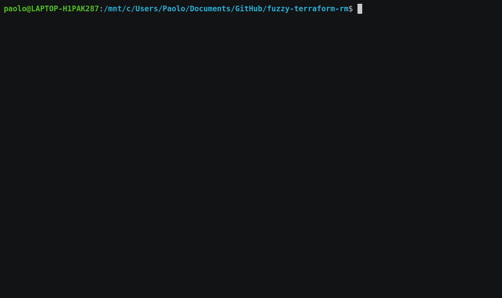

# fuzzy-terraform-rm

fuzzy-terraform-rm is a command-line tool for removing resources from the terraform state



It uses the excellent [go-fuzzyfinder](https://github.com/ktr0731/go-fuzzyfinder) library for the fuzzy-finding functionality.

## Installation

```bash
$ go install github.com/paololazzari/fuzzy-terraform-rm@latest
```

## Usage

```bash
$ fuzzy-terraform-rm
```

N.B. To select multiple resources at once, use the tab key.

## How it works

fuzzy-terraform-rm looks at the terraform source (.tf) files and at the terraform state to determine which resources can be removed.
